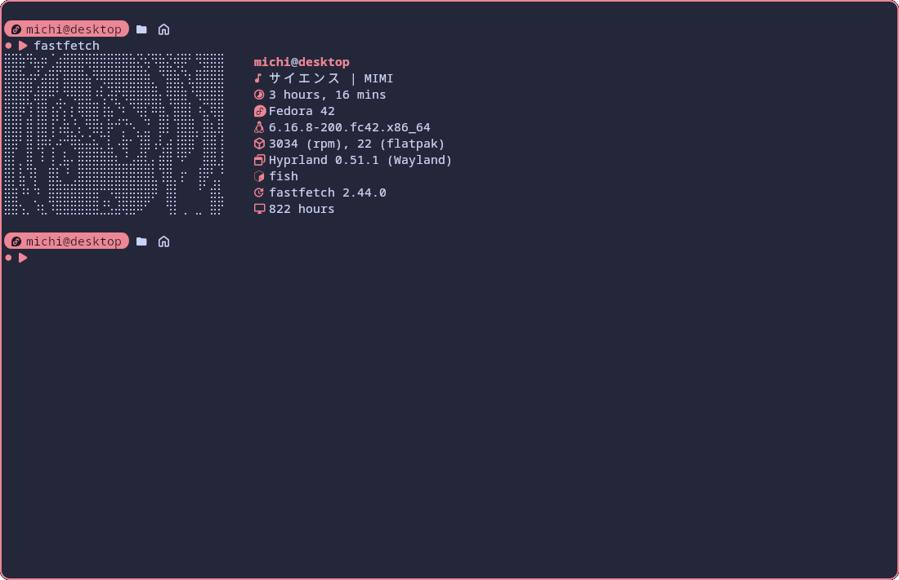

# About
Anijouhou (from Japanese アニメ情報 = anime information) is an [AniList](https://anilist.co/) profile statistics viewer for the terminal.

<a href="#license"> </a>
<a href="https://codeberg.org/legendofmaj/anijouhou"> </a>
<a href="https://codeberg.org/legendofmaj/anijouhou"> </a>

# Screenshots
| [anijouhou](https://github.com/legendofmaj/anijouhou/releases) | [anijouhou with fastfetch](https://github.com/fastfetch-cli/fastfetch) |
| :-----------------------------------------------------------:  | :--------------------------------------------------------------------: |
|                      |                    |

# Installation
```bash
cargo install --git "https://codeberg.org/legendofmaj/anijouhou.git"
```
>[!Note]
> Alternatively you can also install anijouhou via precompiled binaries. <br>
> This might be useful if you are on Windows or don't have cargo installed.
> Installation instructions can be found [here](docs/installation_from_precompiled_binaries.md).

# Build from source
Clone the repository and open the directory.
```bash
git clone https://github.com/legendofmaj/anijouhou.git && cd anijouhou
```
Build the project.
```bash
cargo build --release
```
Copy the binary to a directory in your PATH.
```bash
sudo cp target/release/anijouhou /usr/bin/
```

# Usage
## Basic usage
```bash
anijouhou <username>
```
>[!Note] 
> If you want to get information about the same profile again, you can omit `<username>`.

## File management
Clear cache (automatically cleared daily): 
```bash
anijouhou -c
# or
anijouhou --clear-cache
```
Delete user data directory (`~/.config/anijouhou/` or `%APPDATA%\anijouhou\`): 
```bash
anijouhou -d 
# or
anijouhou --delete
```
## Output formatting
```bash
anijouhou -t # text only
anijouhou -h # hours
anijouhou -m # minutes
anijouhou -e # episodes
```
Or alternatively:
```bash
anijouhou --text
anijouhou --hours
anijouhou --minutes
anijouhou --episodes
```
## Supplying user data via command line arguments
Give api key via command line argument: 
```bash
anijouhou <username> -k <api-key>
# or
anijouhou <username> --api-key <api-key>
```
>[!Important]
> If you give `skip` as the api key, none will be used.

## miscellaneous
On Windows the terminal will stay open when starting `anijouhou.exe`. To prevent this behavior (e.g. when starting anijouhou from PowerShell) use:
```PowerShell
.\anijouhou.exe --automatically-close
```
On Linux the behavior is the opposite. If you would want anijouhou to stay open (e.g. when starting it via a `.desktop` file) use:
```bash
./anijouhou --automatically-close
```

# Configuration
The look of anijouhou can be customized via a configuration file located at `~/.config/anijouhou/config.toml`. <br>
A default configuration will be created when the application is first run. <br>
Below you can see the default configuration:
```toml
# Changes the size of the profile picture and spacing between profile picture and text.
scaling_factor = 0.8
# You can add as many modules as you like, however they will be cut off once they take up more space than your profile picture.
[[modules]]
# Valid values are: `username`, `watchtime_hours`, `watchtime_minutes`,`episodes`, genre_1 (and 2, 3) and genre_1_hours (and 2, 3).
# Everything else will be regarded as a normal string.
value = "username"
value_bold = true
[[modules]]
icon = "--------------"
icon_bold = false
[[modules]]
# `value` and `unit` also have `value.bold` / `unit_color` options.
icon = "󰦖 "
icon_color = "#1e66f5"
icon_bold = false
value = "watchtime_hours"
unit = " hours"
[[modules]]
icon = " "
icon_color = "#1e66f5"
icon_bold = false
value = "watchtime_minutes"
unit = " minutes"
[[modules]]
icon = "󰻏 "
icon_color = "#1e66f5"
icon_bold = false
value = "episodes"
unit = " episodes"
[[modules]]
icon = " "
icon_color = "#1e66f5"
icon_bold = false
value = "genre_1"
# !NoNewLine means the next module will not appear on a new line
# You can still use a normal unit. In this case use `unit = " my_unit!NoNewLine"
unit = "!NoNewLine"
[[modules]]
icon = " ("
icon_bold = false
value = "genre_1_hours"
unit = " hours)"
[[modules]]
icon = "󰲣 "
icon_color = "#1e66f5"
icon_bold = false
value = "genre_2"
unit = "!NoNewLine"
[[modules]]
icon = " ("
icon_bold = false
value = "genre_2_hours"
unit = " hours)"
[[modules]]
icon = "󰲥 "
icon_color = "#1e66f5"
icon_bold = false
value = "genre_3"
unit = "!NoNewLine"
[[modules]]
icon = " ("
icon_bold = false
value = "genre_3_hours"
unit = " hours)"
```

# Tips and tricks
## Use anijouhou in fastfetch
Add the following to your `~/.config/fastfetch/config.jsonc`
```jsonc 
{
  "type": "command",
  "text": "anijouhou -h" // or any other flag you want
}
```
## Switch between accounts
Should you want to switch between multiple private accounts, you can do so with a shell script like the one shown below.
```bash
#!/bin/bash
username_1="your_username"
api_key_1="your_api_key"

username2="your_second_username"
api_key_2="your_second_api_key"

if [[ $1 == "$username_1" ]];
then
  anijouhou "$username_1" -k "$api_key_1"
else
  anijouhou "$username_2" -k "$api_key_2"
fi
```
To run the script: 
```bash
chmod +x script_name.sh && ./script_name.sh
```
>[!Important]
> This script requires `bash` to be installed. It does not work on Windows, unless you use WSL.
## Use anijouhou on Android via Termux
Install necessary dependencies
```bash
pkg install rust openssl
```
Install anijouhou
```bash
cargo install --git "https://github.com/legendofmaj/anijouhou.git"
```

# Credits
This project would not have been possible without the following amazing libraries: <br>
- [serde](https://github.com/serde-rs/serde) copyright [serde-rs](https://github.com/serde-rs) licensed under the [MIT](https://github.com/serde-rs/json/blob/master/LICENSE-MIT)
- [serde_json](https://github.com/dtolnay/serde-json) copyright [serde-rs](https://github.com/serde-rs) licensed under the [MIT](https://github.com/serde-rs/serde/blob/master/LICENSE-MIT)
- [reqwest](https://github.com/seanmonstar/reqwest) copyright [Sean McArthur](https://github.com/seanmonstar) licensed under the [MIT](https://github.com/seanmonstar/reqwest/blob/master/LICENSE-MIT)
- [tokio](https://github.com/tokio-rs/tokio) copyright the [Tokio Contributors](https://github.com/tokio-rs/tokio/graphs/contributors) licensed under the [MIT](https://github.com/tokio-rs/tokio/blob/master/LICENSE).
- [terminal_size](https://github.com/eminence/terminal-size) copyright [The terminal-size Developers](https://github.com/eminence/terminal-size/graphs/contributors) licensed under the [MIT](https://github.com/eminence/terminal-size/blob/master/LICENSE-MIT)
- [viuer](https://github.com/atanunq/viuer/) copyright [Atanas Yankov](https://github.com/atanunq) licensed under the [MIT](https://github.com/atanunq/viuer/blob/master/LICENSE-MIT)
- [image](https://github.com/image-rs/image/) copyright [image-rs](https://github.com/image-rs/) licensed under the [MIT](https://github.com/image-rs/image/blob/main/LICENSE-MIT)
- [open](https://github.com/Byron/open-rs/) copyright [Sebastian Thiel](https://github.com/Byron) licensed under the [MIT](https://github.com/Byron/open-rs/blob/main/LICENSE.md)
- [chrono](https://github.com/chronotope/chrono) copyright [Kang Seonghoon and contributors](https://github.com/chronotope/chrono/graphs/contributors) licensed under the [MIT](https://github.com/chronotope/chrono/blob/main/LICENSE.txt)
- [colored](https://github.com/colored-rs/colored/) licensed under the [MPL-2.0](https://github.com/colored-rs/colored?tab=MPL-2.0-1-ov-file)
- [toml](https://github.com/toml-rs/toml/) copyright [Individual contributors](https://github.com/toml-rs/toml/graphs/contributors) licensed under the [MIT](https://github.com/toml-rs/toml/blob/main/LICENSE-MIT)

# License
As per requirement of the MPLv2 licensed [colored-crate](https://github.com/colored-rs/colored/) this project is dual-licensed under the [MPLv2](LICENSE-MPL) and [GPLv3](LICENSE).