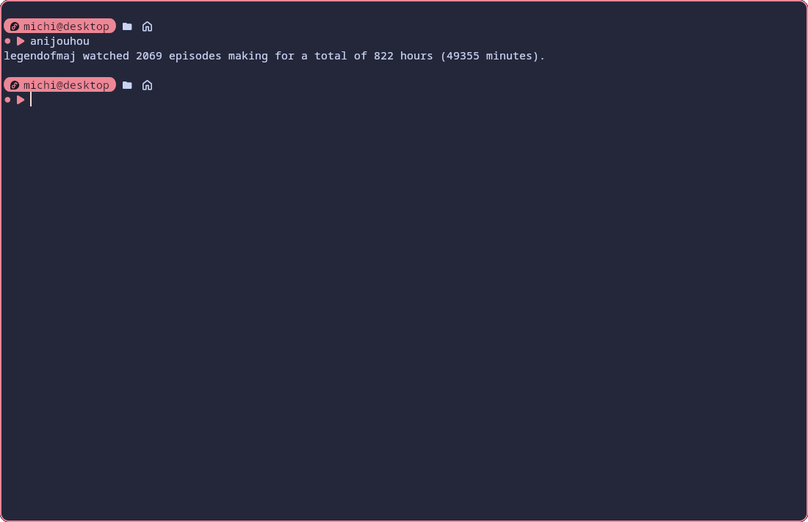

# About
anijouhou (アニメ情報) is a terminal application that displays the total amount of time spent watching anime by fetching data from [anilist](https://anilist.co/).

# Screenshots
| [anijouhou](https://github.com/legendofmaj/anijouhou/releases) | [anijouhou with fastfetch](https://github.com/fastfetch-cli/fastfetch) |
| :-----------------------------------------------------------:  | :--------------------------------------------------------------------: |
|                      |                    |

# Installation
## via cargo
```bash
cargo install --git "https://github.com/legendofmaj/anijouhou.git"
```

## via precompiled binaries
Download the binaries either from the [release page](https://github.com/legendofmaj/anijouhou/releases) or to get the latest development version from [GitHub actions](https://github.com/legendofmaj/anijouhou/actions).

In order to launch anijouhou from your terminal emulator you will need to copy the binary to a directory in your path. If you don't need that, you can skip the following steps.
### On Linux
```bash
sudo cp anijouhou /usr/bin/
```
### On Windows
- make sure a bin directory is present e.g.: `C:\Users\YourUsername\bin\` (If not, create one)
- move `anijouhou.exe` to the directory
- add your bin directory to PATH:
  - open settings
  - search for path and choose `edit the system environment variables`
  - click on `environment variables`
  - choose `path` and click `edit`
  - choose `new` and add your bin directory
  - click ok to all the close dialogues
- launch the app with `anijouhou` in any terminal

# Build from source
Clone the repository and go into the directory.
```bash
git clone https://github.com/legendofmaj/anijouhou.git && cd anijouhou
```
Build the project.
```bash
cargo build --release
```
Copy the binary to a directory in your PATH.
```bash
cp target/release/anijouhou $HOME/.cargo/bin/
```

# Usage
## Basic usage
```bash
anijouhou <username>
```
If you want to get information about the same profile again, you can omit `<username>`.

## File management
Clear cache (automatically cleared daily): 
```bash
anijouhou -c
# or
anijouhou --clear-cache
```
Delete user data directory (`$HOME/.config/anijouhou/` or `%APPDATA%\anijouhou\`): 
```bash
anijouhou -d 
# or
anijouhou --delete
```
## Output formatting
Get total watchtime in:
```bash
anijouhou -h # hours
anijouhou -m # minutes
anijouhou -e # episodes
```
Or alternatively:
```bash
anijouhou --hours
anijouhou --minutes
anijouhou --episodes
```
## Supplying user data via command line arguments
>[!TIP]
> If no flag is passed, but an argument, anijouhou assumes since  `v0.3.5` that the argument is a username of a public user.
> This means that `anijouhou -u <your-username> -k skip` is equivalent to `anijouhou <your-username>`.

Give username via command line argument:
```bash
anijouhou -u <your-username> 
# or 
anijouhou --username <your-username>
```
Give api key via command line argument: 
```bash
anijouhou -k <api-key> 
# or 
anijouhou --api-key <api-key>
```
>[!Important]
> If you give `skip` as the api key, none will be used.

## miscellaneous
On Windows the terminal will stay open when starting `anijouhou.exe`. To prevent this behavior (e.g. when starting anijouhou from PowerShell) use:
```PowerShell
.\anijouhou.exe --automatically-close
```
On Linux the behavior is the opposite. If you would want anijouhou to stay open (e.g. when starting it via a `.desktop` file) use:
```bash
./anijouhou --automatically-close
```

# Tips and tricks
## Use anijouhou in fastfetch
Add the following to your `~/.config/fastfetch/config.jsonc`
```jsonc 
{
  "type": "command",
  "text": "anijouhou -h" // or any other flag you want
}
```
## Switch between accounts
Should you want to switch between multiple private accounts, you can do so with a shell script like the one shown below.
```bash
#!/bin/bash
username_1="your_username"
api_key_1="your_api_key"

username2="your_second_username"
api_key_2="your_second_api_key"

if [[ $1 == "$username_1" ]];
then
  anijouhou "$username_1" -k "$api_key_1"
else
  anijouhou "$username_2" -k "$api_key_2"
fi
```
To run the script: 
```bash
chmod +x script_name.sh && ./script_name.sh
```
>[!Important]
> This script requires `bash` to be installed. It does not work on Windows, unless you use WSL.
## Use anijouhou on Android via Termux
Install necessary dependencies
```bash
pkg install rust openssl
```
Install anijouhou
```bash
cargo install --git "https://github.com/legendofmaj/anijouhou.git"
```