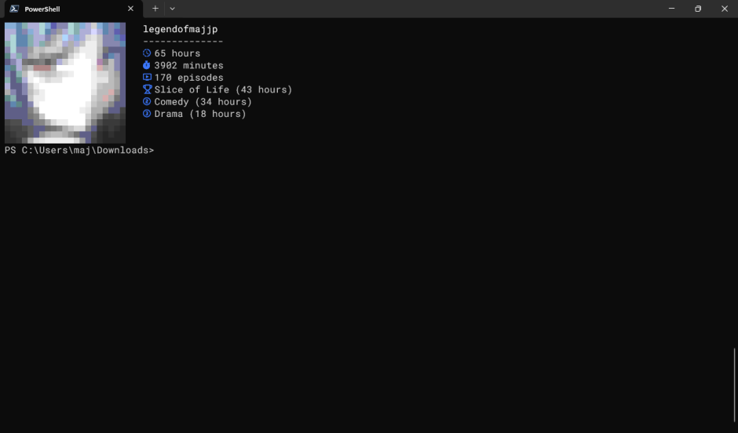

# Installation via precompiled binaries
## Download
Download the binaries either from the [release page](https://github.com/legendofmaj/anijouhou/releases) or to get the latest development version from [GitHub actions](https://github.com/legendofmaj/anijouhou/actions).

## Basic usage
### On Linux
Start the executable from the terminal:
```bash
./anijouhou
```
Or double click on on it from nautilus (or any other file manager).
>[!Important]
> If you cannot run the file, you might need to be make it executable via
>```bash
>chmod +x anijouhou
> ```
### On Windows
Double click on the `.exe` in File Explorer.<br>
Or from the terminal run:
```PowerShell
.\anijouhou.exe --close-automatically
```
#### A note on Windows compatibility
While `anijouhou` does run on Windows, it feels rather cluncky in the default Windows Terminal, since you have to press `CTRL` to actually print the image, and doesn't look as good, as Windows Terminal only supports printing Sixels.
You might be better of using `anijouhou -t`, looking for a better terminal emulator that supports Windows or running it via WSL and `kitty`.
#### Anijouhou on Windows screenshot


## Run installed binaries from anywhere
In order to launch anijouhou from any folder with your terminal emulator you will need to copy the binary to a directory in your path. If you don't need that, you can skip the following steps.
### On Linux
```bash
sudo cp anijouhou /usr/bin/
```
### On Windows
- make sure a bin directory is present e.g.: `C:\Users\YourUsername\bin\` (If not, create one)
- move `anijouhou.exe` to the directory
- add your bin directory to PATH:
  - open settings
  - search for path and choose `edit the system environment variables`
  - click on `environment variables`
  - choose `path` and click `edit`
  - choose `new` and add your bin directory
  - click ok to all the close dialogues
- launch the app with `anijouhou` in any terminal

# Installation of symbols
These symbols are included in [NerdFonts](https://www.nerdfonts.com/).

To install a NerdFont go to https://www.nerdfonts.com/font-downloads and download a font you like.
## On Linux
Extract the file you downloaded to a directory using:
```bash
mkdir NerdFontName
unzip NerdFontName.zip -d NerdFontName
```
Copy the extracted folder to your font directory using:
```bash
sudo cp -r NerdFontName /usr/share/fonts
```
Updated your font cache using:
```bash
fc-cache -fv
```
## On Windows
Open the Downloads folder in File Explorer <br>
Unzip the file by right-clicking on it and clicking `Extract All` <br>
Open the unzipped folder <br>
Click on any or all of the TrueType font files you will find within it. <br>
Click `install` in the menu that will pop up. <br>
>[!Important]
> Should the icons still not appear, follow the instructions provided [here](https://ardalis.com/install-nerd-fonts-terminal-icons-pwsh-7-win-11/) to set a default font in Windows Terminal.